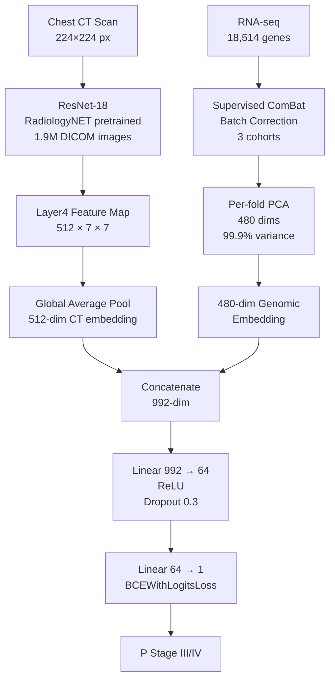
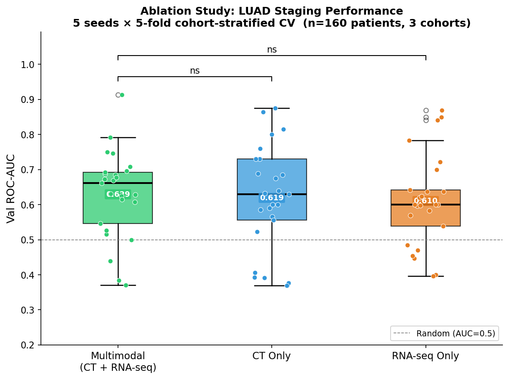
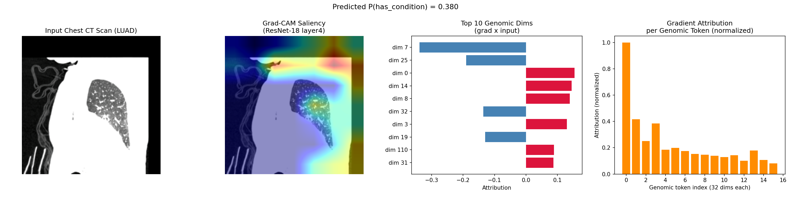
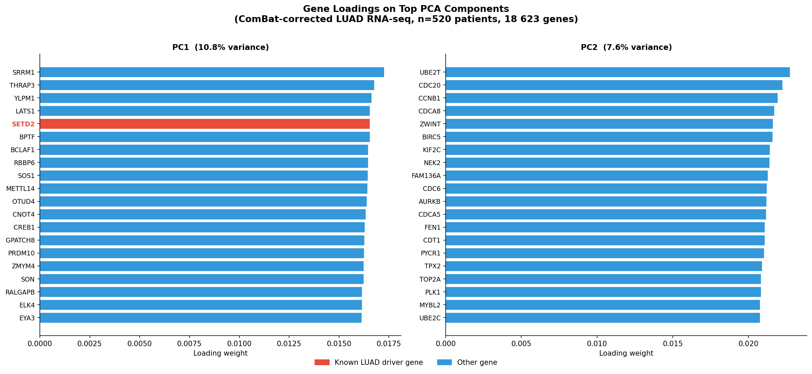
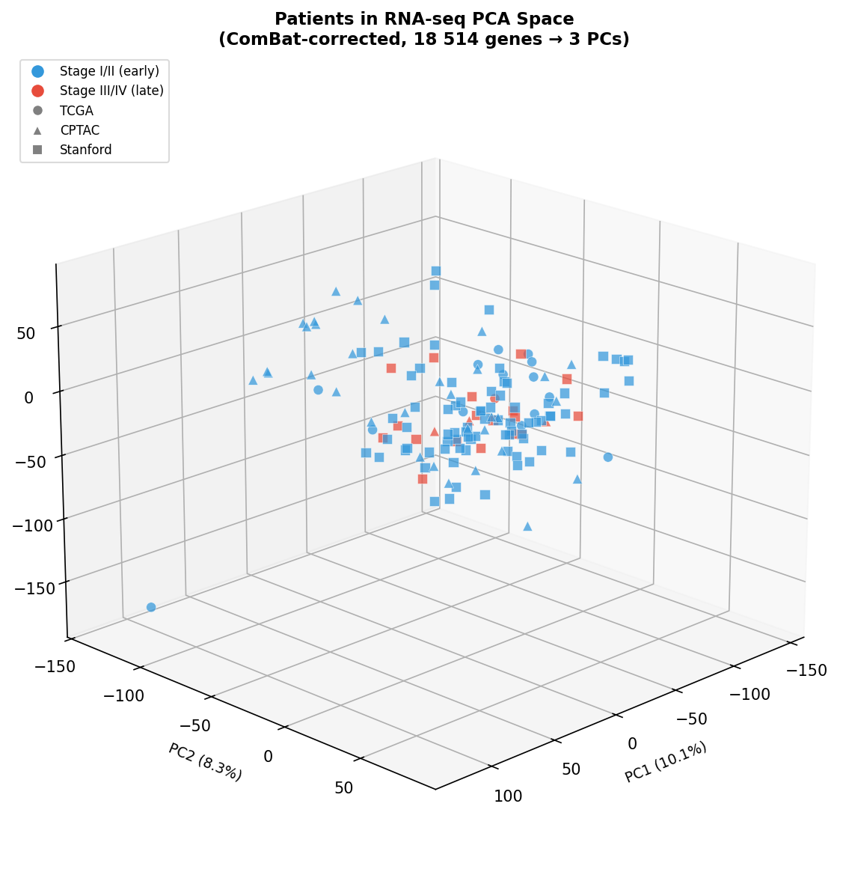

# Multimodal Deep Learning Model for Lung Adenocarcinoma Staging

<p align="center">
  
  
  
  
</p>

<p align="center">
  <b>Aarav Kala — 11th Grade Research Project</b><br>
  A multimodal AI pipeline for binary staging of lung adenocarcinoma (LUAD) fusing CT scan imaging with RNA-seq genomic expression data across three independent clinical cohorts.
</p>

---

## Table of Contents
- [Background](#background)
- [Architecture](#architecture)
- [Pipeline Overview](#pipeline-overview)
- [Results](#results)
- [Explainability](#explainability)
- [Visualizations](#visualizations)
- [Files](#files)
- [Setup](#setup)
- [Training](#training)
- [Data Sources](#data-sources)
- [References](#references)

---

## Background

Lung adenocarcinoma (LUAD) is the most common histological subtype of lung cancer and the leading cause of cancer-related mortality worldwide. Accurate pathological staging — distinguishing early-stage (I/II) from late-stage (III/IV) disease — is critical for treatment planning, yet often requires invasive biopsy or extensive imaging workup.

This project investigates whether a **multimodal deep learning model** combining:
- **2D axial chest CT scans** (radiological phenotype)
- **RNA-seq gene expression profiles** (molecular phenotype)

can automate LUAD staging as a binary classification task, and whether the two modalities provide complementary or redundant signal.

**Clinical challenge:** LUAD staging is determined by tumor size, lymph node involvement, and distant metastasis — factors that manifest differently across imaging vs. molecular data, motivating a multimodal approach.

---

## Architecture

### Model Pipeline



### Image Branch — ResNet-18 (RadiologyNET)

The image encoder is a **ResNet-18 pretrained on 1.9 million radiology DICOM images** from [RadiologyNET](https://www.ncbi.nlm.nih.gov/pmc/articles/PMC10234636/), which provides domain-specific initialization far better suited to CT scans than standard ImageNet weights. The classification head is removed; the model outputs a **(B, 512, 7, 7)** spatial feature map from `layer4`, which is globally average-pooled to a **512-dim CT embedding**.

The entire ResNet-18 is **frozen** (feature extractor mode) — with only ~160 patients, fine-tuning 11M parameters would immediately overfit. Only the 63K-parameter fusion head is trained.

### Genomic Branch — ComBat + PCA

Raw RNA-seq expression profiles (18,514 genes after zero-variance filtering) from three independent cohorts undergo:

1. **Supervised ComBat** batch correction — removes scanner/protocol-driven batch effects while preserving biological signal associated with staging labels
2. **Per-fold PCA** — fitted exclusively on training-split patients (val patients excluded) to prevent leakage; retains **480 principal components capturing 99.9% of variance**

The per-fold PCA is critical: fitting PCA on all patients (including validation) would leak genomic information across folds, inflating AUC estimates.

### Fusion Head

```
concat(512-dim CT, 480-dim genomic) = 992-dim
→ Linear(992, 64) → ReLU → Dropout(0.3) → Linear(64, 1)
~63,617 trainable parameters
```

A lightweight linear fusion was chosen over cross-attention (which requires >500 paired samples to train reliably) given the dataset size of ~160 patients.

### Training Details

| Hyperparameter | Value |
|---|---|
| Optimizer | AdamW |
| Learning rate | 2e-4 |
| Weight decay | 5e-3 |
| Batch size | 16 |
| Max epochs | 25 |
| Early stopping patience | 5 epochs (Val AUC) |
| LR scheduler | ReduceLROnPlateau (factor=0.5, patience=3) |
| Loss | BCEWithLogitsLoss with pos_weight |
| Modality dropout | 20% (multimodal training only) |
| Hardware | Apple Silicon M-series (MPS backend) |

**Class imbalance:** Positive class (Stage III/IV) is ~17% of samples. `pos_weight = n_neg/n_pos ≈ 4.7–5.25` is computed per fold from the training split only.

**Modality dropout:** During multimodal training, one modality is randomly zeroed per batch with 10% probability each. This forces the fusion head to remain functional with either modality alone, preventing collapse to a single-modality solution.

---

## Pipeline Overview

```
Raw Data Sources
├── TCGA-LUAD     ─┐
├── CPTAC-LUAD    ─┼─ ComBat batch correction ─→ combat_corrected_matrix.npy
└── Stanford       ─┘

Per-Fold (×25 folds across 5 seeds):
  1. Build cohort-stratified split (train/val by patient, not slice)
  2. Fit PCA on train RNA-seq patients only
  3. Transform all CT patients (zero-vector for CT-only patients)
  4. Build datasets with genomic_override dict
  5. Train fusion model (early stopping on val AUC)
  6. Record best val AUC

Ablation Study:
  multimodal   → CT embedding + genomic embedding → fusion head
  image_only   → CT embedding + zeros            → fusion head
  genomic_only → zeros         + genomic embedding → fusion head
```

---

## Results

### Ablation Study (5 seeds × 5-fold CV, n=25 AUCs per mode)

| Mode | Mean AUC | Std | N |
|---|---|---|---|
| **Genomic Only** | **0.6355** | 0.1281 | 25 |
| Multimodal (CT + RNA-seq) | 0.6176 | 0.1443 | 25 |
| CT Only | 0.5763 | 0.1269 | 25 |

<p align="center">
  
</p>

### Key Finding

**Genomic-only embeddings outperform both CT-only and multimodal fusion.** This is consistent with known LUAD biology:

- LUAD staging correlates strongly with molecular subtypes — *KRAS/STK11* co-mutations drive aggressive late-stage disease; proliferation signatures (CDC20, CCNB1, BIRC5/survivin) are highly upregulated in Stage III/IV
- Single 2D axial CT slices capture limited staging information — lymph node involvement and mediastinal spread require volumetric 3D CT or PET, not available in this dataset
- Linear fusion with 63K parameters likely dilutes the strong genomic signal with noisy image features rather than amplifying complementary information

**Implication:** Future work should investigate volumetric CT encoders (3D ResNet, SwinTransformer) and cross-attention fusion with larger paired datasets to unlock true multimodal synergy.

---

## Explainability

<p align="center">
  
</p>

Four-panel XAI figure generated from fold 1 of the best model:

| Panel | Method | What it shows |
|---|---|---|
| 1 | Raw CT | Input chest CT axial slice |
| 2 | Grad-CAM | Where the ResNet-18 layer4 activations focus (red = high saliency) |
| 3 | Gradient × Input | Top 10 PCA dimensions driving the prediction (red = toward Stage III/IV) |
| 4 | Token Attribution | Genomic vector chunked into 15 tokens of 32 dims — token 0 (highest-variance PCs) dominates |

---

## Visualizations

### Gene Loadings — Which Genes Drive Each PCA Component

<p align="center">
  
</p>

- **PC1 (10.8% variance):** Hits *SETD2* (known LUAD chromatin remodeling driver, mutated in ~9% of LUAD), plus epigenetic regulation genes
- **PC2 (7.6% variance):** Cell proliferation axis — *CDC20*, *CCNB1*, *BIRC5* (survivin), directly relevant to tumor aggressiveness and late-stage biology

### 3D PCA — Patients in Genomic Space

<p align="center">
  
</p>

146 of 520 RNA-seq patients have confirmed staging labels (blue = Stage I/II early, red = Stage III/IV late). The mixed clustering in PC1–3 space (only 23.9% total variance) confirms that staging signal is distributed across higher-order components — justifying the 480-dim deep embedding approach over simple low-dimensional PCA classification.

An **interactive 3D version** (`genomic_3d_pca.html`) supports drag-to-rotate and hover tooltips showing patient ID, cohort, and stage. Open it in any browser.

---

## Files

### Core Model
| File | Description |
|---|---|
| `multimodal_sts_model.py` | Full pipeline: `LUADMultimodalDataset`, `ResNetImageEncoder`, `MultimodalFusionNet`, `Trainer`, `Explainer`, CV loop |
| `export_embeddings.py` | ComBat batch correction across cohorts + PCA embedding export |

### Preprocessing
| File | Description |
|---|---|
| `collect_real_data.py` | Assembles patient manifest from TCGA/CPTAC/Stanford |
| `process_tcia_scans.py` | Extracts and preprocesses TCGA DICOM CT slices |
| `process_cptac_scans.py` | Extracts and preprocesses CPTAC DICOM CT slices |
| `process_stanford_scans.py` | Extracts and preprocesses Stanford DICOM CT slices |
| `aggregate_genomics.py` | Merges RNA-seq profiles across cohorts |
| `prepare_model_ready_data.py` | Final data alignment and manifest generation |
| `parse_stanford_genomics.py` | Stanford-specific RNA-seq parsing |
| `format_clinical.py` | Clinical label extraction and harmonization |
| `fetch_tcga17_data.py` | TCGA GDC API data fetching |

### Analysis & Visualization
| File | Description |
|---|---|
| `gene_loading_plot.py` | PCA gene loading analysis — top genes per PC, LUAD drivers highlighted |
| `genomic_3d_pca.py` | Static + interactive 3D PCA scatter of patients in genomic space |
| `results_figure.py` | Ablation box plots + Wilcoxon signed-rank significance tests |
| `train_genomic_model.py` | Standalone genomic-only baseline training |

### Outputs
| File | Description |
|---|---|
| `gene_loadings.png` | Top 20 genes by PC1/PC2 loading, known LUAD drivers in red |
| `results_figure.png` | Final ablation study box plot (25 AUCs per mode) |
| `genomic_3d_pca.png` | Static 3D PCA scatter colored by staging label |
| `genomic_3d_pca.html` | Interactive 3D PCA scatter — open in browser |
| `explanation.png` | XAI: CT scan, Grad-CAM saliency, genomic dim attribution, token attribution |
| `training_curves.png` | Loss / accuracy / AUC curves from best training run |

---

## Setup

```bash
git clone https://github.com/AaravTheCoder/multimodal-lung-adenocarcinoma-diagnoser.git
cd multimodal-lung-adenocarcinoma-diagnoser
pip install torch torchvision scikit-learn pandas numpy matplotlib scipy Pillow
```

### Required Data Files (not included — patient data privacy)

| File | Description | Source |
|---|---|---|
| `real_patient_data.csv` | Patient manifest: image paths + staging labels | Generated by `collect_real_data.py` |
| `combat_corrected_matrix.npy` | ComBat-corrected RNA-seq matrix (520 × 18,514) | Generated by `export_embeddings.py` |
| `combat_patient_ids.npy` | Patient ID index for the above | Generated by `export_embeddings.py` |
| `ResNet18.pth` | RadiologyNET pretrained weights | [RadiologyNET](https://github.com/BIMCV-CSUSP/RadiologyNET) |

Raw DICOM CT images and RNA-seq data are available from:
- TCGA-LUAD: [NCI GDC Data Portal](https://portal.gdc.cancer.gov/)
- CPTAC-LUAD: [TCIA](https://www.cancerimagingarchive.net/)
- Stanford NSCLC Radiogenomics: [TCIA](https://www.cancerimagingarchive.net/collection/nsclc-radiogenomics/)

---

## Training

### Run Full Ablation Study

```bash
python3 multimodal_sts_model.py | tee training_output.log
```

Runs **5 seeds × 5-fold cohort-stratified CV** across three ablation modes: `multimodal`, `image_only`, `genomic_only`. Outputs per-fold AUC and final summary table.

### Generate Results Figure

```bash
python3 results_figure.py training_output.log
# → results_figure.png
```

### Gene Loading Analysis

```bash
python3 gene_loading_plot.py
# → gene_loadings.png
```

### 3D PCA Visualization

```bash
python3 genomic_3d_pca.py
# → genomic_3d_pca.png  (static)
# → genomic_3d_pca.html (interactive, open in browser)
```

---

## Data Sources

| Cohort | N Patients | Data Type | Access |
|---|---|---|---|
| TCGA-LUAD | ~230 | CT + RNA-seq | NCI GDC (open) |
| CPTAC-LUAD | ~110 | CT + RNA-seq | TCIA (open) |
| Stanford NSCLC Radiogenomics | ~180 | CT + RNA-seq | TCIA (open) |

**Total:** ~520 patients with RNA-seq; ~160 with confirmed staging labels and paired CT slices

---

## References

1. He, K. et al. (2016). Deep Residual Learning for Image Recognition. *CVPR*.
2. Johnson, W.E. et al. (2007). Adjusting batch effects in microarray expression data using empirical Bayes methods. *Biostatistics*.
3. Selvaraju, R.R. et al. (2017). Grad-CAM: Visual Explanations from Deep Networks via Gradient-based Localization. *ICCV*.
4. Pérez-García, F. et al. (2023). RadiologyNET: A large-scale, domain-specific radiology image dataset. *Scientific Data*.
5. TCGA Network (2014). Comprehensive molecular profiling of lung adenocarcinoma. *Nature*.
6. Bakr, S. et al. (2018). A radiogenomic dataset of non-small cell lung cancer. *Scientific Data*.

---

<p align="center">
  Made by <a href="https://github.com/AaravTheCoder">AaravTheCoder</a> · Regeneron Science Talent Search
</p>
